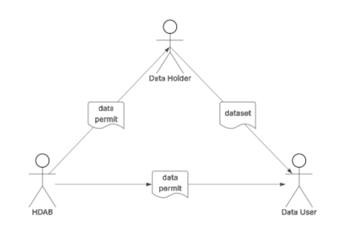
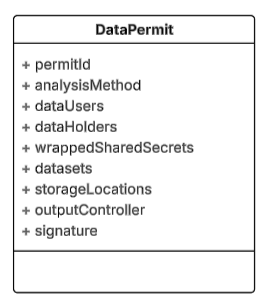

## A Cryptographic Data Permit Mechanism for Secure Secondary Use of Health Data in the European Health Data Space


####  HDAB-Coordinated At-Source Pseudonymization Enabling Deterministic Data Linking Across Multiple Data Holders  

---

### Abstract

The European Health Data Space (EHDS) Regulation (EU) 2025/327 promotes the secondary use of electronic health data while upholding the highest standards of privacy protection. By default, data processed for secondary purposes must be anonymized; pseudonymization is permitted only when essential to preserve analytical utility—particularly to enable reliable linkage of records across datasets from multiple data holders, whether at national level or between EU Member States.

Conventional approaches typically employ central pseudonymization services, requiring data holders to transmit identifiable personal data to a trusted third party. This introduces substantial privacy and security risks during data transfer.

This proposal introduces a cryptographic data permit mechanism that enables pseudonymization at source while ensuring consistent, deterministic pseudonyms across all involved data holders. As a result, reliable record linkage becomes possible within a single Secure Processing Environment (SPE) without raw personal identifiers ever leaving the data holder’s controlled environment.

The core innovation lies in the synergistic combination of the following two elements:

- the use of the data permit as an **active cryptographic** instrument that serves as a secure, auditable authorization and coordination token, and  
- the use of **key wrapping** to securely distribute a data-application specific shared secret to authorized data holders through this permit.

Together, these enable fully decentralized yet perfectly synchronized pseudonym generation, eliminating the need for raw shared secret transfers while preserving end-to-end privacy and security.

### Introduction

The European Health Data Space (EHDS) Regulation requires each Member State to designate a Health Data Access Body (HDAB) responsible for facilitating the secure secondary use of electronic health data. In the Netherlands, the HDAB-NL programme—led by the Ministry of Health, Welfare and Sport (VWS) in collaboration with Health-RI, RIVM, CBS, and ICTU—is developing the necessary infrastructure, metadata catalogue, data access application management system (DAAMs) and Secure Processing Environments (SPEs).

**Key Challenges in Multi-Data-Holder Integration**
Integrating data from multiple independent data holders while complying with strict EHDS privacy requirements presents several fundamental difficulties:
- **Central pseudonymization**: This approach requires data holders to transfer raw personal identifiers to a trusted third party, creating significant privacy and security risks during transmission and temporary storage.
- **Independent at-source pseudonymization**: While safer, it produces inconsistent pseudonyms across holders, forcing reliance on probabilistic (fuzzy) matching techniques and resulting in reduced linkage quality and analytical utility.
- **Coordination and end-to-end security**: Orchestrating secure key distribution, data exchange, access controls, and workflow synchronisation across decentralised parties remains complex and error-prone.

This proposal directly addresses these challenges. It aligns fully with EHDS data minimisation and privacy-by-design principles by enabling pseudonymization at source with deterministic consistency, thereby maximising privacy protection while preserving high-quality cross-data-holder record linkage.

### The Proposed Solution
The solution introduces a **cryptographic data permit mechanism** in which the HDAB issues a machine-readable, digitally signed permit that serves as both an authorisation token and a secure coordination instrument. Through **key wrapping**, the permit securely distributes a project-specific shared secret to all authorised data holders, enabling them to perform consistent deterministic pseudonymization locally. The resulting pseudonymised datasets are uploaded to designated storage locations, where they can be mounted and linked within a Secure Processing Environment—without raw personal identifiers ever leaving the data holders’ controlled environments. 

This approach eliminates the privacy risks of central identifier transfer, avoids the linkage degradation of uncoordinated pseudonymization, and provides the HDAB with a robust mechanism to orchestrate secure, auditable, and EHDS-compliant multi-holder data provision. 

The mechanism is equally applicable to cross-border data linkage. However, the effectiveness of deterministic pseudonymization for reliable record linkage depends on the availability of uniform or harmonised personal identifiers (e.g., national ID numbers, health insurance IDs, or other stable direct identifiers) across the participating data holders and Member States. In cases where such uniform identifiers are absent or inconsistent, supplementary techniques—such as probabilistic matching or additional privacy-preserving record linkage methods—may be required to achieve sufficient linkage quality.

In order to facilitate seamless, privacy-preserving cross-border secondary use of health data as envisaged by the EHDS, this cryptographic data permit mechanism is proposed for adoption at the European level.

### Core Concept

The core concept revolves around transforming the data permit into a **cryptographically signed, machine-readable authorization and coordination token**. This active cryptographic instrument enables secure, privacy-preserving secondary use of electronic health data **without ever disclosing raw personal identifiers to third parties** or the data user.

The permit can either complement an existing administrative ("paper") permit or fully integrate its cryptographic functionality into the standard EHDS data permit. By embedding securely wrapped shared secrets and explicit workflow instructions, the data permit becomes an **operational cryptographic mechanism**. 

A operational cryptographic data permit facilitates:
- secure authorization of data holders and data users,
- coordinated at-source pseudonymization with deterministic consistency
- controlled provision of pseudonymized datasets to designated storage locations
- reliable record linkage across multiple pseudonymized datasets within a SPE

This design ensures end-to-end privacy while providing the Health Data Access Body (HDAB) with a powerful, auditable tool for orchestrating compliant multi-holder and cross-border data access.

### Detailed Solution Description

#### Mechanism Overview


Figure 1. Mechanism Overview

1. The HDAB issues a digitally signed data permit to the **data user**, and **all data holders** involved in a certain data application (data request or data access application)
2. Data holders **validate the authenticity** of the permit by verifing the signature of the permit
3. Data holders **unwrap the shared secret**, with their own private key
4. Data holders perform **local pseudonymization** on the requested dataset based on the shared secret
5. Data holders place the pseudonymized dataset on the **specific storage location** as indicated by the permit
6. In the SPE, the authenticated data user uploads the permit, ingests the pseudonymized datasets from the storage locations indicated in the permit and and **links the datasets** based on the pseudonomized records
7. The linked dataset is **available for analysis**
- Once the research is completed, output control can be carried out by the output controller as indicated in the permit


#### Identities

Data holders generate a public–private key pair upfront, leveraging eIDAS-compatible or national public key infrastructure (PKI). The corresponding public keys are registered with the HDAB and are used to authenticate the data holders and to enable secure cryptographic operations, such as the wrapping of shared secrets.

Data users are required to generate and register certified public keys with the HDAB infrastructure. These keys are used to establish their identity, authenticate access requests, and, where applicable, to verify authorisations and signatures associated with issued permits. All registered keys must be issued or certified by a trusted certificate authority recognised by the HDAB.

Key lifecycle management, including key rotation, revocation, and expiry, is governed by the applicable PKI policies and is enforced by the HDAB to ensure continued trust in participant identities.

#### Permit issuance

The HDAB generates a random, data-application-specific shared secret K. For each authorised data holder, K is individually encrypted ("wrapped") using the holder’s registered public key, e.g., via RSA-OAEP or post-quantum ML-KEM. Demos included, RSA: [demo_rsa.py](demo_rsa.py), Post Quantum KEM/DSA: [demo_pq.py](demo_pq.py)

The resulting data permit object (Figure 2) binds together the authorised parties, datasets, analysis method, and cryptographic material required to securely execute the approved data application.


Figure 2. Data permit object

Data permit attributes:

- **permitId** is the unique identifier given to the permit by the issuing HDAB
- **dataUsers** list of authorized data users
- **dataHolders** list of data holder's id's (and potentially public keys to enable central key wrapping)
- **datasetId** list of the identifiers of the datasets involved in this data application
- **analysisMethod** the analysis and linking method used in for this data application deterministric-pseudonymization.
- **sharedSecrets** list of shared secret, encrypted per dataholder
- **outputController** identity of the designated output controller
- **signature** added to the permit by the issuing HDAB for verification by the data holders and validated at the issuing certificate authority

Once issued, the permit is distributed to the relevant data holders and data users. Each data holder verifies the HDAB signature, decrypts its wrapped instance of K, and enforces access and processing controls in accordance with the permit attributes. The shared secret K is used exclusively within the scope of the specified data application and analysis method

> **Note:** Above permit only shows attributes relavant for demonstrating the mechanism, full sample permit available in [sample_permit.json](sample_permit.json) 

#### Authorization

The data permit explicitly defines and enables the following authorisations:
- Write access for data holders: Each authorised data holder receives temporary, scoped write permissions to the specific storage location(s) indicated in the permit for their dataset(s). This allows them to upload the locally pseudonymised dataset after processing, while preventing read access to other holders’ data or unrelated locations.
- Read access for data users in the SPE: Authenticated data users (researchers) are granted read-only access to all relevant storage locations, but only within the Secure Processing Environment. The SPE mounts these locations based on the validated permit, ensuring that data ingestion occurs in an isolated, controlled setting with no possibility of exfiltration of raw or pseudonymised data outside the SPE.
- No direct access outside the workflow: Neither data holders nor data users can access the storage locations outside the permit-defined context. Permissions are time-bound (aligned with the permit’s validity period) and purpose-specific, automatically revoked upon expiry or completion of the application.
- Auditable and revocable: All access grants are traceable to the signed permit, enabling the HDAB to monitor compliance and revoke permissions if necessary (e.g., in case of misuse or project termination). d

#### Key exchange

- **HDAB public key** The permit includes the HDAB’s public key to enable participants to verify the HDAB’s digital signature on the permit itself. In this proof-of-concept implementation, the full public key is embedded directly in the permit for simplicity and immediate usability. In production deployments, data holders and SPEs should validate the HDAB’s signing certificate against a trusted national or eIDAS-qualified certificate authority, eliminating the need to embed the key and allowing standard revocation checking (CRL/OCSP)
- **Data Holder Public Keys** Each authorised data holder registers a certified public key (e.g., RSA-2048/3072 or post-quantum equivalent) with the HDAB in advance.
These public keys are included in the permit within the structured dataHolders array
- **Data User Identities** The identities of authorised data users (researchers or analysts) are explicitly listed in the permit under the dataUsers field. Each entry includes a strong, verifiable identifier (preferably an eIDAS-qualified electronic identification or a national researcher registry URN), along with optional human-readable attributes such as name, organisation, and role.
These identities serve as the basis for authentication and access control within the Secure Processing Environment (SPE). The SPE validates the uploaded permit and grants access only to users whose authenticated identity matches one of the listed entries, ensuring that only approved individuals can ingest datasets, perform linkage, and conduct analysis.

#### Key wrapping

In order to be able to share the pseudonymization key across data holders, the designated HDAB generates a random shared secret `K`, specific for each data application.    For each authorized holder `DHᵢ` the shared secret `K` is encrypted so that only that specific data holder is able to decrypt a single shared secret. This means that for a data application with multiple dataholders the wrapped shared secret appears multiple times in in the permit, each wrapped for a specific dataholder.

   ```text
   wrappedSecretᵢ = PK-Encrypt(PubKeyᵢ, K)
   ```
Each dataholder unwraps the shared secret K and uses this for pseudonymization. There is no reason for the data holder to store the shared secret since it it can be directly derived from the permit.

##### storage locations

The cryptographic data permit explicitly designates storage locations for the pseudonymised datasets contributed by each data holder. These locations—typically access-controlled object storage buckets (e.g., S3-compatible endpoints), encrypted repositories, or equivalent cloud-based storage services—act as secure, neutral intermediaries between data holders and the Secure Processing Environment (SPE).

## Extensibility

This mechanism can also be extended to support additional privacy-preserving analysis paradigms beyond deterministic pseudonymization. By including an extensible analysisMode field in the permit, future modes such as secure multi-party computation (MPC) queries, federated learning, and federated analytics can be supported by instructing the data holders how to prepare the data. In these modes, the same cryptographic permit serves as the coordination and authorisation vehicle.

### Conclusion

The cryptographic data permit mechanism presented in this whitepaper offers a robust, privacy-enhancing solution for the secure secondary use of electronic health data within the European Health Data Space (EHDS). By transforming the conventional data permit into an active cryptographic instrument, it enables at-source pseudonymization with deterministic consistency across multiple data holders, while ensuring that raw personal identifiers never leave the controlled environment of the data holder.

**Key Benefits**
- Maximum Privacy Protection: Raw personal data remains confined to the data holder's premises, eliminating the risks associated with centralised identifier transfers.
- High-Quality Record Linkage: Deterministic pseudonyms allow precise cross-data-holder and cross-border linkage in Secure Processing Environments, preserving essential analytical utility.
- Full EHDS Compliance: The approach aligns with the Regulation's emphasis on data minimisation, pseudonymization only when necessary (as justified for linkage under relevant provisions, including Recital 72 on early de-identification), and strong technical safeguards.
- Future-Proof Design: Post-quantum readiness through support for ML-KEM key encapsulation and ML-DSA signing protects against emerging quantum threats.

